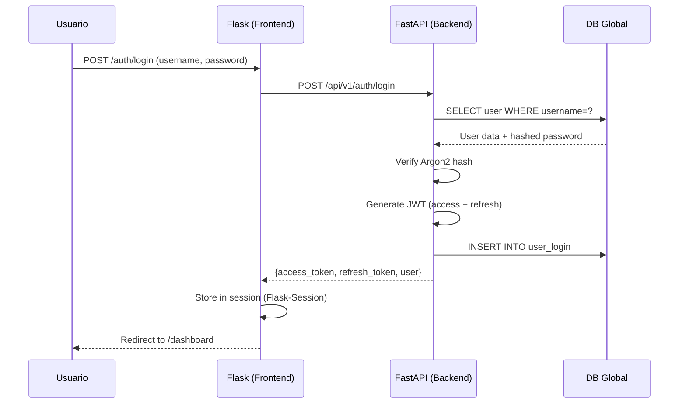
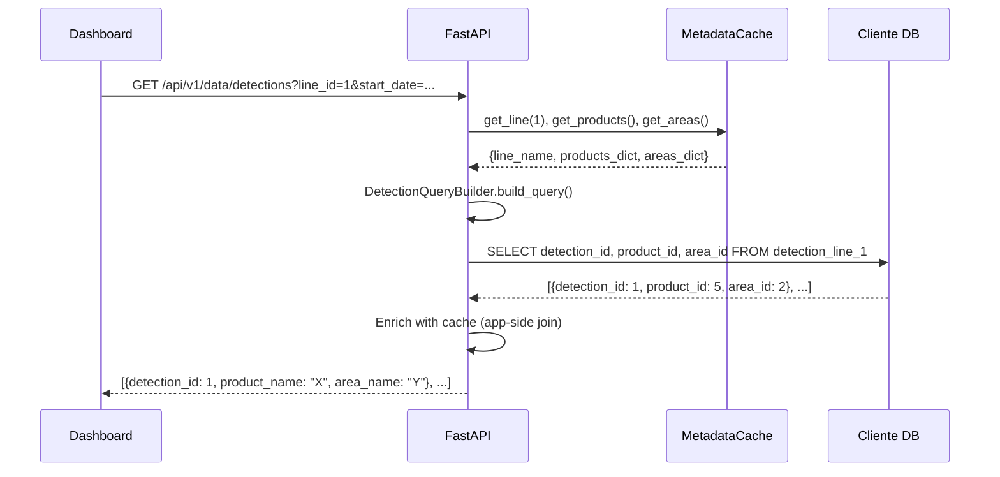
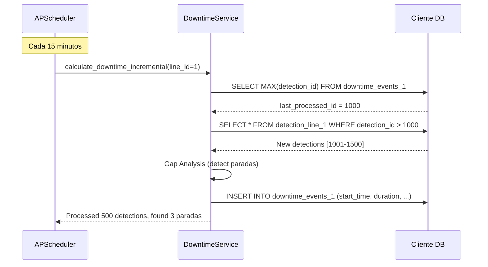
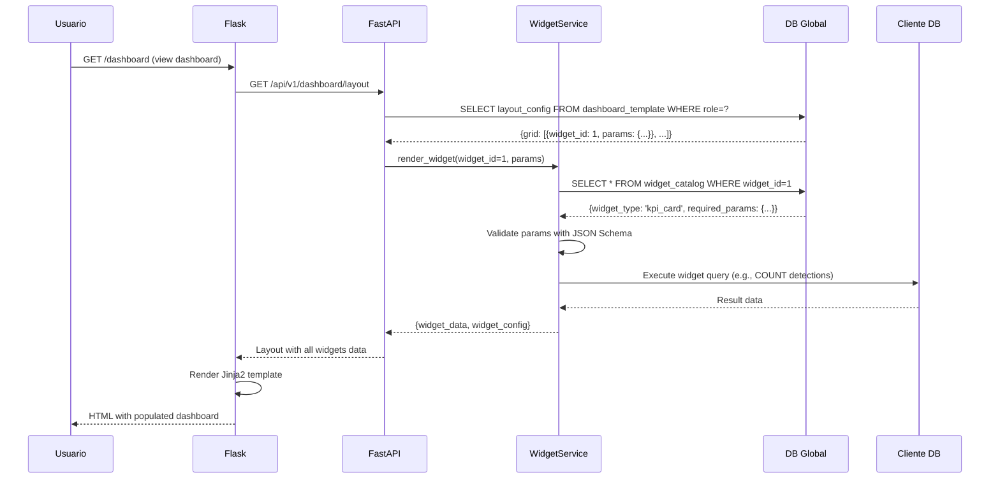
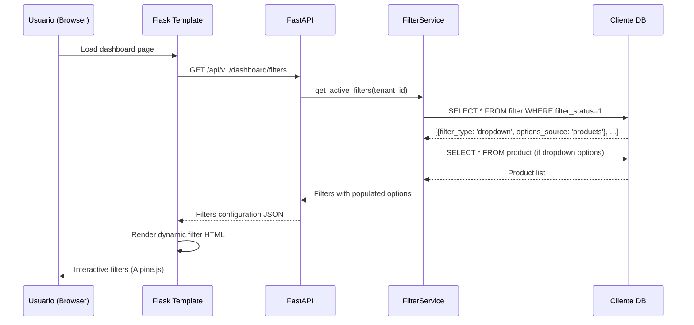

Project Context - Dashboard SaaS Industrial
📋 Contextualización del Proyecto para Agentes IA

**Última Actualización:** 30 Enero 2026
**Estado del Proyecto:** ✅ Funcional y en Producción
**Versión:** 1.0.0

---

🎯 CONTEXTO GENERAL DEL PROYECTO

**Nombre del Proyecto:**
Dashboard SaaS Industrial - Sistema de Monitoreo de Producción en Tiempo Real

**Descripción:**
Sistema web multi-tenant completo para monitoreo y análisis de líneas de producción industrial. Permite visualizar métricas de producción (OEE, paradas, eficiencia), analizar datos históricos, gestionar configuración de planta y generar insights operativos. El sistema es altamente configurable y se adapta a diferentes clientes sin modificaciones de código (Configuration over Code).

**Objetivos Principales:**
✅ Dashboard genérico 100% configurable desde base de datos
✅ Arquitectura multi-tenant con separación completa de datos
✅ Autenticación segura con roles granulares (RBAC)
✅ Visualización de datos de producción en tiempo real
✅ Cálculo automático de KPIs (OEE, disponibilidad, rendimiento, calidad)
✅ Sistema de widgets dinámicos sin código hardcoded
✅ Motor de detección de paradas automático
✅ Optimización para hosting en cPanel con recursos limitados
✅ Escalabilidad horizontal (agregar clientes sin tocar código)

---
🏗️ ARQUITECTURA TÉCNICA

**Stack Tecnológico Implementado:**

```yaml
Backend API:
  Framework: FastAPI 0.110.0          # API REST de alto rendimiento
  Server: Uvicorn 0.29.0              # ASGI server con soporte async
  ORM: SQLAlchemy 2.0.29              # ORM con soporte asyncio completo
  Validación: Pydantic 2.7.0          # Validación y serialización
  Tareas: APScheduler 3.10.4          # Background tasks (cálculo paradas)
  
Frontend SSR:
  Framework: Flask 3.0.2              # Server-Side Rendering
  Templates: Jinja2                   # Template engine
  Interactividad: HTMX 1.9.10        # Actualizaciones parciales sin JS pesado
  Reactivity: Alpine.js 3.13.3       # Lógica cliente ligera
  Styling: Tailwind CSS 3.x          # Utility-first CSS
  Charts: Chart.js 4.4.0             # Visualización de datos

Base de Datos:
  Motor: MySQL 8.0+ / MariaDB        # Base de datos relacional
  Driver: aiomysql 0.2.0             # Driver async para MySQL
  Migrations: Alembic 1.13.1         # Gestión de migraciones
  Partitioning: Monthly RANGE        # Particionamiento por mes

Seguridad:
  Passwords: Argon2-cffi 23.1.0      # Hashing resistente a GPU
  JWT: PyJWT 2.8.0                   # Tokens de autenticación
  CSRF: Flask-WTF 1.2.1              # Protección Cross-Site
  Rate Limit: SlowAPI 0.1.9          # Limitación de requests
  
HTTP Client:
  Cliente: httpx 0.27.0              # Cliente HTTP async
  
Utilities:
  Env: python-dotenv 1.0.1           # Variables de entorno
  Timezone: pytz 2024.1              # Manejo de zonas horarias
  System: psutil 5.9.8               # Monitoreo del sistema
```

---

**Arquitectura de Bases de Datos:**

```
┌─────────────────────────────────────────────────────────────┐
│                    CAMET_GLOBAL                              │
│               (Base de Datos Global)                         │
│                                                              │
│  ┌───────────────────────────────────────────────────┐      │
│  │ GESTIÓN MULTI-TENANT                              │      │
│  │  • tenant (4 registros activos)                   │      │
│  │  • user (usuarios con permissions JSON)           │      │
│  │  • user_login (historial de sesiones)             │      │
│  │  • audit_log (log de auditoría inmutable)         │      │
│  │  • user_query (trazabilidad de consultas)         │      │
│  └───────────────────────────────────────────────────┘      │
│                                                              │
│  ┌───────────────────────────────────────────────────┐      │
│  │ CATÁLOGOS DEL SISTEMA                             │      │
│  │  • widget_catalog (18 widgets disponibles)        │      │
│  │  • dashboard_template (layouts por rol)           │      │
│  └───────────────────────────────────────────────────┘      │
└─────────────────────────────────────────────────────────────┘

┌─────────────────────────────────────────────────────────────┐
│              CLIENTE_X (DB por Tenant)                       │
│     Ejemplo: db_client_camet_robotica                        │
│                                                              │
│  ┌───────────────────────────────────────────────────┐      │
│  │ ESTRUCTURA DE PLANTA                              │      │
│  │  • production_line (líneas activas)               │      │
│  │  • area (zonas de detección)                      │      │
│  │  • product (catálogo de productos)                │      │
│  │  • shift (configuración de turnos)                │      │
│  │  • filter (10 filtros dinámicos)                  │      │
│  └───────────────────────────────────────────────────┘      └─────────┐
│                                                                       │
│  ┌─────────────────────────────────────────────────────────────┐      │
│  │ BIG DATA (Tablas Particionadas)                             │      │
│  │  • detection_line_{line name} (millones de registros)       │      │
│  │  • detection_line_{line name} (particiones mensuales)       │      │
│  │  • downtime_events_{line name} (paradas calculadas)         │      │
│  │  • downtime_events_{line name} (persisten indefinidamente)  │      │
│  └─────────────────────────────────────────────────────────────┘   ────┘      
│                                                              │
│  ┌───────────────────────────────────────────────────┐      │
│  │ SISTEMA Y MONITOREO                               │      │
│  │  • system_config (configuración K/V)              │      │
│  │  • system_monitor (telemetría)                    │      │
│  │  • failure / incident (gestión de fallas)         │      │
│  └───────────────────────────────────────────────────┘      │
└─────────────────────────────────────────────────────────────┘
```

**Estrategia de Optimización:**
✅ **Caché in-memory** para metadatos (Productos, Áreas, Líneas) - Carga < 1s
✅ **Particionamiento mensual** en tablas DETECTION_LINE_X - Query pruning automático
✅ **Application-side joins** - Sin JOINs pesados en MySQL
✅ **Connection pooling** - Reutilización de conexiones DB
✅ **Async I/O** - Operaciones no bloqueantes con asyncio

---
📐 PRINCIPIOS DE DISEÑO Y PATRONES IMPLEMENTADOS

**1. Configuration over Code (Motor de Reglas):**
El sistema actúa como un "motor genérico" que interpreta la configuración almacenada en la base de datos para renderizar la UI y procesar datos, sin lógica hardcoded específica por cliente.

Implementación:
- ✅ WIDGET_CATALOG define 18 tipos de widgets con sus parámetros
- ✅ DASHBOARD_TEMPLATE almacena layouts personalizados por rol
- ✅ FILTER tabla configura filtros dinámicos sin tocar código
- ✅ JSON Schema valida parámetros automáticamente
- ✅ Templates Jinja2 renderizan componentes desde configuración

**2. Application-Side Joins (Optimización de Performance):**
No se realizan JOINs masivos entre tablas de detecciones y metadatos. En su lugar:

Implementación:
- ✅ MetadataCache carga toda la configuración en memoria al inicio
- ✅ DetectionService enriquece IDs con datos desde caché
- ✅ Ventaja: Reduce carga de MySQL hasta en 90%
- ✅ Queries retornan solo IDs, enriquecimiento en Python

**3. Seguridad OWASP Top 10:**
El sistema implementa las mejores prácticas de seguridad web.

Implementación:
- ✅ **SQL Injection:** ORM parametrizado (SQLAlchemy)
- ✅ **XSS:** Templates Jinja2 con auto-escape
- ✅ **CSRF:** Tokens en todos los formularios (Flask-WTF)
- ✅ **Authentication:** JWT con refresh tokens y rotación
- ✅ **Hashing:** Argon2 con time_cost=2, memory_cost=65536
- ✅ **Rate Limiting:** 100 req/min general, 20 req/min en auth
- ✅ **Session Management:** Timeout configurable, max 3 sesiones concurrentes
- ✅ **Security Headers:** X-Frame-Options, CSP, HSTS

**4. Modularización y Separación de Responsabilidades:**
Arquitectura en capas con patrones de diseño probados.

Implementación:
- ✅ **Repository Pattern:** Capa de acceso a datos aislada
- ✅ **Service Layer:** Lógica de negocio separada de endpoints
- ✅ **Dependency Injection:** FastAPI dependencies para DB, auth, etc.
- ✅ **Middleware Chain:** Tenant context, audit, rate limit, security
- ✅ **Blueprints (Flask):** Organización modular de rutas
- ✅ **Schemas (Pydantic):** Validación fuerte de I/O

**5. Optimización para Entornos Limitados:**
Diseñado para funcionar en hosting cPanel compartido.

Restricciones y Soluciones:
- ❌ Sin Redis disponible → ✅ Caché in-memory con asyncio.Lock
- ❌ Sin Docker en producción → ✅ Virtualenv tradicional
- ❌ Recursos CPU/RAM limitados → ✅ Queries optimizados, particiones
- ❌ MySQL estándar sin extensiones → ✅ Particionamiento nativo RANGE

---
🎨 DISEÑO VISUAL Y UX

**Paleta de Colores (Dark Mode por Defecto):**
```css
/* Colores Primarios */
--primary: #2b7cee;           /* Azul principal */
--primary-dark: #1a5bb5;      /* Azul oscuro para hovers */

/* Backgrounds */
--bg-light: #F3F4F6;          /* Fondo claro (modo claro) */
--bg-dark: #0f172a;           /* Fondo oscuro principal */
--surface-dark: #1e293b;      /* Superficie de tarjetas */
--surface-hover: #334155;     /* Hover estado */

/* Texto */
--text-main: #1e293b;         /* Texto principal (modo claro) */
--text-light: #f1f5f9;        /* Texto principal (modo oscuro) */
--text-sub: #64748b;          /* Texto secundario */
--text-muted: #94a3b8;        /* Texto deshabilitado */

/* Estados */
--success: #10b981;           /* Verde éxito */
--warning: #f59e0b;           /* Naranja advertencia */
--error: #ef4444;             /* Rojo error */
--info: #3b82f6;              /* Azul información */
```

**Tipografía:**
```css
Font Family: 'Inter', system-ui, sans-serif
Weights: 300 (Light), 400 (Regular), 500 (Medium), 600 (Semibold), 700 (Bold)
Source: Google Fonts
Line Height: 1.5 (body), 1.2 (headings)
```

**Componentes UI Implementados:**
✅ **Dark Mode:** Tema oscuro por defecto con toggle
✅ **Sidebar:** Navegación colapsable con iconos Material Symbols
✅ **Header:** Breadcrumbs, búsqueda, notificaciones, perfil
✅ **Cards:** Componentes de tarjetas reutilizables con sombras
✅ **Forms:** Inputs, selects, checkboxes con validación visual
✅ **Buttons:** Primary, secondary, ghost, danger con estados
✅ **Modals:** Sistema de modales con overlay
✅ **Toasts:** Notificaciones tipo toast para feedback
✅ **Loading States:** Spinners y skeletons
✅ **Responsive:** Breakpoints: sm(640px), md(768px), lg(1024px), xl(1280px)

**Iconografía:**
- Material Symbols (Google) - 2,500+ iconos
- Outlined style por defecto
- Peso: 400, Tamaño: 24px base

---
📊 FLUJOS DE DATOS IMPLEMENTADOS

**1. Flujo de Autenticación Completo:**


**2. Flujo de Consulta de Datos con Caché:**


**3. Flujo de Cálculo de Paradas (APScheduler):**


**4. Flujo de Renderizado de Widget Dinámico:**


**5. Flujo de Filtro Dinámico:**


---
Registra en AUDIT_LOG
Carga caché de metadatos del cliente
Renderiza dashboard según rol
Flujo de Consulta de Datos:
Usuario aplica filtros (fecha, línea, producto)
HTMX envía request a FastAPI
Service valida y construye query dinámico
Repository ejecuta query en tabla particionada
Enriquece datos con caché (app-side join)
Calcula métricas (OEE, paradas)
Widget service formatea para Chart.js
Flask renderiza template con datos
Registra consulta en USER_QUERY
Flujo de Cálculo de Paradas:
Background task (APScheduler) cada 15 min
Obtiene últimas detecciones del área de salida
Calcula diferencia temporal entre detecciones
Si diff > threshold → registra en DOWNTIME_EVENTS_X
Actualiza KPIs

📁 ESTRUCTURA DEL PROYECTO

dashboard-saas/
│
├── .env.example                    # Template de variables de entorno
├── .env.development               # Configuración local
├── .env.production                # Configuración cPanel
├── requirements.txt               # Dependencias Python
├── Dockerfile                     # Opcional para desarrollo
├── docker-compose.yml             # Opcional para desarrollo
├── README.md
├── TODO.md                        # Lista de tareas futuras
│
├── app/
│   ├── __init__.py
│   ├── main.py                    # Entry point FastAPI
│   ├── wsgi.py                    # Entry point Flask (producción)
│   │
│   ├── core/                      # Configuración central
│   │   ├── __init__.py
│   │   ├── config.py              # Settings (BaseSettings de Pydantic)
│   │   ├── security.py            # JWT, hashing, CSRF
│   │   ├── database.py            # Conexiones DB (global + clients)
│   │   ├── cache.py               # Sistema de caché in-memory
│   │   ├── logging.py             # Configuración de logs
│   │   └── dependencies.py        # Dependency injection (get_db, get_current_user)
│   │
│   ├── models/                    # SQLAlchemy Models
│   │   ├── __init__.py
│   │   ├── base.py                # Base declarativa
│   │   ├── global_db/             # Modelos DB_GLOBAL
│   │   │   ├── __init__.py
│   │   │   ├── tenant.py
│   │   │   ├── user.py
│   │   │   ├── audit.py
│   │   │   └── template.py        # WIDGET_CATALOG, DASHBOARD_TEMPLATE
│   │   └── client_db/             # Modelos DB_CLIENT
│   │       ├── __init__.py
│   │       ├── production.py      # PRODUCTION_LINE, AREA
│   │       ├── product.py
│   │       ├── filter.py
│   │       ├── shift.py
│   │       ├── incident.py        # FAILURE, INCIDENT
│   │       ├── detection.py       # Modelo dinámico para DETECTION_LINE_X
│   │       ├── downtime.py        # Modelo dinámico para DOWNTIME_EVENTS_X
│   │       └── system.py          # SYSTEM_CONFIG, SYSTEM_MONITOR
│   │
│   ├── schemas/                   # Pydantic Schemas (request/response)
│   │   ├── __init__.py
│   │   ├── auth.py                # LoginRequest, TokenResponse
│   │   ├── user.py                # UserCreate, UserResponse
│   │   ├── tenant.py
│   │   ├── production.py
│   │   ├── query.py               # QueryFilters, DateRangeRequest
│   │   └── dashboard.py           # WidgetConfig, DashboardLayout
│   │
│   ├── api/                       # Endpoints FastAPI
│   │   ├── __init__.py
│   │   ├── v1/
│   │   │   ├── __init__.py
│   │   │   ├── auth.py            # /login, /logout, /refresh
│   │   │   ├── users.py           # CRUD usuarios
│   │   │   ├── tenants.py         # CRUD tenants (admin only)
│   │   │   ├── production.py      # CRUD líneas, áreas, productos
│   │   │   ├── data.py            # Consultas de detecciones
│   │   │   ├── dashboard.py       # Endpoints para widgets
│   │   │   └── system.py          # Monitoreo, health checks
│   │
│   ├── services/                  # Lógica de negocio
│   │   ├── __init__.py
│   │   ├── auth_service.py        # Autenticación, generación de tokens
│   │   ├── tenant_service.py      # Gestión de tenants
│   │   ├── cache_service.py       # Precarga de metadatos
│   │   ├── query_builder.py       # Constructor dinámico de queries SQL
│   │   ├── detection_service.py   # Lógica de detecciones + app-side joins
│   │   ├── downtime_service.py    # Cálculo de paradas
│   │   ├── metrics_service.py     # Cálculo de KPIs (OEE, eficiencia)
│   │   ├── widget_service.py      # Interpretación de WIDGET_CATALOG
│   │   └── audit_service.py       # Registro en AUDIT_LOG
│   │
│   ├── repositories/              # Capa de acceso a datos (patrón Repository)
│   │   ├── __init__.py
│   │   ├── base_repository.py     # CRUD genérico
│   │   ├── user_repository.py
│   │   ├── tenant_repository.py
│   │   ├── production_repository.py
│   │   └── detection_repository.py
│   │
│   ├── middleware/                # Middlewares personalizados
│   │   ├── __init__.py
│   │   ├── tenant_context.py      # Inyecta tenant_id en contexto
│   │   ├── audit_middleware.py    # Log automático de requests
│   │   ├── rate_limit.py          # Rate limiting por IP/usuario
│   │   └── security_headers.py    # OWASP headers
│   │
│   ├── utils/                     # Utilidades
│   │   ├── __init__.py
│   │   ├── datetime_helpers.py    # Manejo de turnos, rangos
│   │   ├── validators.py          # Validaciones custom
│   │   ├── partition_manager.py   # Gestión de particiones MySQL
│   │   └── exceptions.py          # Excepciones personalizadas
│   │
│   ├── templates/                 # Jinja2 Templates (Flask)
│   │   ├── base.html              # Layout principal
│   │   ├── auth/
│   │   │   ├── login.html
│   │   │   └── logout.html
│   │   ├── dashboard/
│   │   │   ├── index.html         # Dashboard principal
│   │   │   ├── filters.html       # Panel de filtros
│   │   │   └── widgets/           # Widgets individuales
│   │   │       ├── production_chart.html
│   │   │       ├── kpi_cards.html
│   │   │       ├── comparison_bar.html
│   │   │       ├── product_pie.html
│   │   │       └── downtime_table.html
│   │   ├── admin/
│   │   │   ├── tenants.html
│   │   │   ├── users.html
│   │   │   └── config.html
│   │   └── errors/
│   │       ├── 404.html
│   │       ├── 500.html
│   │       └── 403.html
│   │
│   ├── static/                    # Archivos estáticos
│   │   ├── css/
│   │   │   ├── tailwind.min.css   # Build de Tailwind
│   │   │   └── custom.css
│   │   ├── js/
│   │   │   ├── htmx.min.js
│   │   │   ├── alpine.min.js
│   │   │   ├── chart.min.js
│   │   │   └── dashboard.js       # Lógica custom
│   │   └── img/
│   │       └── logo.svg
│   │
│   └── tasks/                     # Background tasks (Celery/APScheduler)
│       ├── __init__.py
│       ├── downtime_calculator.py # Calcula paradas periódicamente
│       ├── partition_maintenance.py # Crea/elimina particiones
│       └── cache_refresh.py       # Actualiza caché de metadatos
│
├── migrations/                    # Alembic migrations
│   ├── env.py
│   ├── script.py.mako
│   └── versions/
│       ├── 001_initial_global_db.py
│       └── 002_initial_client_db_template.py
│
├── scripts/                       # Scripts de utilidad
│   ├── init_db.py                 # Inicializa DBs y particiones
│   ├── create_tenant.py           # Script para crear nuevo tenant
│   ├── seed_data.py               # Datos de prueba
│   └── backup_db.sh               # Backup automático
│
└── tests/                         # Tests
    ├── __init__.py
    ├── conftest.py                # Fixtures pytest
    ├── test_auth.py
    ├── test_queries.py
    ├── test_downtime.py
    └── test_widgets.py


🔄 FASES DE DESARROLLO
FASE 1: Fundaciones y Autenticación (Semana 1-2)
Setup proyecto
Configuración DBs
Modelos de autenticación
Sistema de login/logout
RBAC básico
Middleware de seguridad
FASE 2: Sistema de Caché y Metadatos (Semana 2-3)
Modelos de cliente
Sistema de caché in-memory
CRUD configuración de planta
Endpoints de producción
FASE 3-4: Motor de Consultas y Paradas (Semana 3-5)
Query builder dinámico
Particionamiento automático
Detection service
Cálculo de paradas
Background tasks
FASE 5-6: Métricas y Widgets (Semana 5-7)
Cálculo de OEE
Agregaciones por intervalo
Motor de widgets
Dashboard templates
FASE 7: Frontend (Semana 7-8)
Templates Jinja2
Panel de filtros HTMX
Widgets visuales
Dashboard responsivo
FASE 8: Seguridad (Semana 8-9)
OWASP Top 10
Rate limiting
Audit logging
Session management
FASE 9-10: Optimización y Deploy (Semana 9-11)
Índices DB
Performance tuning
Deploy cPanel
Backups automáticos

🎯 DECISIONES TÉCNICAS CLAVE
¿Por qué FastAPI + Flask?
FastAPI: API REST performante con async
Flask: SSR simple y ligero para templates
Separación de responsabilidades
¿Por qué Argon2 sobre Bcrypt?
Más moderno (2015)
Resistente a GPUs/ASICs
Recomendado por OWASP
¿Por qué Application-Side Joins?
Evita JOINs masivos en MySQL
Mejor performance con caché
Escalabilidad
¿Por qué Particionamiento?
Millones de detecciones por año
Queries rápidos en rangos de fechas
Gestión de históricos
¿Por qué in-memory cache vs Redis?
Restricciones de cPanel (no Redis)
Metadatos pequeños (<10MB)
TTL de 1 hora suficiente

📋 CONVENCIONES Y ESTÁNDARES
Código:
PEP 8 para Python
Type hints obligatorios
Docstrings en funciones públicas
Nombres descriptivos (no abreviaturas)
Git:
Commits semánticos: feat:, fix:, refactor:, etc.
Branches: feature/, bugfix/, hotfix/
Pull requests obligatorios
Base de Datos:
snake_case para tablas y columnas
Plural para nombres de tablas
created_at, updated_at en todas las tablas
API:
RESTful conventions
Versionado en URL (/api/v1/)
Status codes HTTP estándar
Respuestas JSON consistentes

🚨 RESTRICCIONES Y LIMITACIONES
Ambiente cPanel:
No Redis disponible
Recursos limitados (RAM, CPU)
No Docker
MySQL 8.0 estándar
Python 3.12
SSH disponible (cron jobs)
Performance:
Queries < 1s
Carga inicial < 3s
Caché hit rate > 90%
Seguridad:
Session timeout: 30 min
Max sesiones concurrentes: 3
Rate limit: 100 req/min
Password min 8 chars


✅ ENFOQUE CORRECTO (Configuration-Driven)
Principio Fundamental:
"La aplicación NO crea la estructura de la base de datos, la CONSUME"
Flujo de Implementación para Nuevo Cliente:
1. Cliente Ya Existe con su DB
   ├── DB_GLOBAL (ya tiene estructura)
   │   ├── TENANT (tu insertas manualmente el nuevo cliente)
   │   ├── USER (creas usuarios del cliente)
   │   ├── WIDGET_CATALOG (ya viene pre-poblado por ti)
   │   └── DASHBOARD_TEMPLATE (defines layout por rol)
   │
   └── DB_CLIENT_{tenant_id} (cliente ya tiene su DB)
       ├── PRODUCTION_LINE (cliente ya tiene sus líneas)
       ├── AREA (cliente ya tiene sus áreas)
       ├── PRODUCT (cliente ya tiene sus productos)
       ├── FILTER (cliente define qué filtros quiere) ← CLAVE
       ├── SHIFT (cliente define sus turnos)
       └── DETECTION_LINE_X (cliente ya registra detecciones)

2. Configurar .env
   └── Apuntar a las DBs del cliente

3. La aplicación arranca y:
   ├── Lee FILTER del cliente → Genera UI de filtros dinámicamente
   ├── Lee WIDGET_CATALOG → Sabe qué widgets existen
   ├── Lee DASHBOARD_TEMPLATE → Sabe qué mostrar según rol
   ├── Lee PRODUCTION_LINE → Carga líneas en caché
   └── Lee AREA, PRODUCT → Carga metadatos en caché

🔧 CORRECCIÓN DE LA FASE 1
LO QUE DEBE CAMBIAR:
❌ NO DEBE EXISTIR:
python
# scripts/create_global_tables.py  ← ELIMINAR
# scripts/init_admin_user.py       ← ELIMINAR

# La aplicación NO crea tablas
# Las tablas ya existen en el cliente
✅ EN SU LUGAR:
python
# scripts/seed_widget_catalog.py
"""
Poblar WIDGET_CATALOG una sola vez (tabla maestra del sistema)
Esta es la ÚNICA tabla que tú controlas y pre-poblas
"""

# scripts/verify_client_db.py
"""
Verificar que la DB del cliente tiene la estructura esperada
"""

# scripts/create_tenant.py
"""
Script para registrar un nuevo cliente en DB_GLOBAL
(solo insertar registro, no crear estructura)
"""

📊 SEPARACIÓN CLARA DE RESPONSABILIDADES
TÚ (Desarrollador) Controlas:
WIDGET_CATALOG (DB_GLOBAL)
Pre-poblado por ti con los widgets disponibles
El cliente NO lo modifica
Es el "catálogo de componentes" del sistema
DASHBOARD_TEMPLATE (DB_GLOBAL)
Tú defines templates por defecto por rol
El cliente puede personalizarlo vía UI admin (futuro)
Código de la aplicación
Motor genérico que interpreta configuración
NO tiene lógica específica de cliente
EL CLIENTE Controla (vía su DB):
FILTER (DB_CLIENT)
json
  {
     "filter_id": 1,
     "filter_name": "Rango de Fechas",
     "filter_status": true,
     "default_value": {"days_back": 7},
     "additional_filter": {
       "type": "daterange",
       "required": true,
       "show_time": true
     }
   }
La app lee esto y genera:
Input de fecha inicio
Input de fecha fin
Input de hora (si show_time=true)
SHIFT (DB_CLIENT)
Cliente define sus turnos
App los carga en filtro de "Turno"
PRODUCTION_LINE, AREA, PRODUCT
Cliente ya los tiene
App los carga en caché y los usa para filtros

🔄 FLUJO CORRECTO DE INICIO DE LA APP
Archivo: app/core/startup.py (NUEVO)
python
"""
Application startup procedures
"""
from sqlalchemy.ext.asyncio import AsyncSession
from app.core.database import db_manager
from app.core.cache import MetadataCache
from app.models.global_db import WidgetCatalog
import os


async def verify_global_db():
    """
    Verificar que DB_GLOBAL tenga la estructura esperada
    NO crea nada, solo verifica
    """
    db_name = os.getenv('DB_GLOBAL_NAME')
    
    async for session in db_manager.get_session(db_name, is_global=True):
        # Verificar que existen registros en WIDGET_CATALOG
        result = await session.execute("SELECT COUNT(*) FROM WIDGET_CATALOG")
        count = result.scalar()
        
        if count == 0:
            raise Exception(
                "WIDGET_CATALOG is empty. Run: python scripts/seed_widget_catalog.py"
            )
        
        print(f"✓ DB_GLOBAL verified ({count} widgets in catalog)")


async def verify_client_db(tenant_id: int):
    """
    Verificar que DB del cliente tenga la estructura esperada
    """
    db_name = f"dashboard_client_{tenant_id}"
    
    required_tables = [
        'PRODUCTION_LINE',
        'AREA',
        'PRODUCT',
        'FILTER',
        'SHIFT'
    ]
    
    async for session in db_manager.get_session(db_name, is_global=False):
        for table in required_tables:
            try:
                result = await session.execute(f"SELECT COUNT(*) FROM {table}")
                count = result.scalar()
                print(f"✓ {table}: {count} records")
            except Exception as e:
                raise Exception(
                    f"Table {table} not found in {db_name}. "
                    f"Client database must be set up before running the app."
                )


async def load_tenant_cache(tenant_id: int) -> MetadataCache:
    """
    Cargar metadatos del cliente en caché
    """
    cache = MetadataCache()
    await cache.load_metadata(tenant_id)
    return cache

📋 NUEVA ESTRUCTURA DE SCRIPTS
Script 1: Seed Widget Catalog (Una sola vez)
python
# scripts/seed_widget_catalog.py
"""
Poblar WIDGET_CATALOG con widgets del sistema
EJECUTAR UNA SOLA VEZ al instalar el sistema
"""
import asyncio
from app.core.database import db_manager
from app.models.global_db import WidgetCatalog
import os


WIDGETS = [
    {
        "widget_name": "Producción por Tiempo",
        "widget_type": "line_chart",
        "required_params": {
            "type": "object",
            "properties": {
                "line_id": {"type": "integer"},
                "start_date": {"type": "string"},
                "end_date": {"type": "string"},
                "interval": {"type": "string"}
            },
            "required": ["line_id", "start_date", "end_date"]
        }
    },
    {
        "widget_name": "Distribución de Productos",
        "widget_type": "pie_chart",
        "required_params": {
            "type": "object",
            "properties": {
                "line_id": {"type": "integer"},
                "start_date": {"type": "string"},
                "end_date": {"type": "string"}
            },
            "required": ["line_id", "start_date", "end_date"]
        }
    },
    # ... más widgets
]


async def seed_widgets():
    db_name = os.getenv('DB_GLOBAL_NAME')
    
    async for session in db_manager.get_session(db_name, is_global=True):
        # Verificar si ya existen
        result = await session.execute("SELECT COUNT(*) FROM WIDGET_CATALOG")
        if result.scalar() > 0:
            print("⚠️  WIDGET_CATALOG already populated. Skipping.")
            return
        
        # Insertar widgets
        for widget_data in WIDGETS:
            widget = WidgetCatalog(**widget_data)
            session.add(widget)
        
        await session.commit()
        print(f"✅ Inserted {len(WIDGETS)} widgets into WIDGET_CATALOG")


if __name__ == "__main__":
    asyncio.run(seed_widgets())
Script 2: Registrar Nuevo Cliente
python
# scripts/register_tenant.py
"""
Registrar un nuevo cliente/tenant en el sistema
"""
import asyncio
from app.core.database import db_manager
from app.models.global_db import Tenant, User
from app.core.security import hash_password
from datetime import datetime
import os


async def register_tenant(
    company_name: str,
    admin_username: str,
    admin_email: str,
    admin_password: str
):
    """
    Registrar nuevo tenant y crear usuario admin
    
    PREREQUISITO: El cliente ya debe tener su DB_CLIENT_{id} creada
    """
    db_name = os.getenv('DB_GLOBAL_NAME')
    
    async for session in db_manager.get_session(db_name, is_global=True):
        # Crear tenant
        tenant = Tenant(
            company_name=company_name,
            asociated_since=datetime.utcnow(),
            is_active=True,
            config_tenant={"theme": "dark", "language": "es"}
        )
        session.add(tenant)
        await session.flush()
        
        # Crear usuario admin
        admin = User(
            tenant_id=tenant.tenant_id,
            username=admin_username,
            email=admin_email,
            password=hash_password(admin_password),
            role="admin",
            permissions={"full_access": True},
            created_at=datetime.utcnow()
        )
        session.add(admin)
        await session.commit()
        
        print(f"✅ Tenant registered successfully!")
        print(f"   Tenant ID: {tenant.tenant_id}")
        print(f"   Company: {company_name}")
        print(f"   Admin User: {admin_username}")
        print(f"   Admin Email: {admin_email}")
        print(f"\n⚠️  IMPORTANT: Ensure database 'dashboard_client_{tenant.tenant_id}' exists!")


if __name__ == "__main__":
    import sys
    
    if len(sys.argv) != 5:
        print("Usage: python scripts/register_tenant.py <company_name> <admin_username> <admin_email> <admin_password>")
        sys.exit(1)
    
    asyncio.run(register_tenant(
        company_name=sys.argv[1],
        admin_username=sys.argv[2],
        admin_email=sys.argv[3],
        admin_password=sys.argv[4]
    ))
Script 3: Verificar DB del Cliente
python
# scripts/verify_client_structure.py
"""
Verificar que la DB del cliente tenga la estructura correcta
"""
import asyncio
from app.core.database import db_manager
import sys


async def verify_structure(tenant_id: int):
    db_name = f"dashboard_client_{tenant_id}"
    
    required_tables = {
        'PRODUCTION_LINE': ['line_id', 'line_name', 'is_active'],
        'AREA': ['area_id', 'line_id', 'area_name', 'area_type'],
        'PRODUCT': ['product_id', 'product_name', 'product_code'],
        'FILTER': ['filter_id', 'filter_name', 'filter_status', 'default_value'],
        'SHIFT': ['shift_id', 'shift_name', 'start_time', 'end_time'],
    }
    
    print(f"Verifying structure of {db_name}...\n")
    
    async for session in db_manager.get_session(db_name, is_global=False):
        for table, columns in required_tables.items():
            try:
                # Verificar tabla existe
                result = await session.execute(f"SELECT COUNT(*) FROM {table}")
                count = result.scalar()
                
                # Verificar columnas existen
                result = await session.execute(f"DESCRIBE {table}")
                existing_columns = [row[0] for row in result.fetchall()]
                
                missing = set(columns) - set(existing_columns)
                if missing:
                    print(f"❌ {table}: Missing columns {missing}")
                else:
                    print(f"✅ {table}: OK ({count} records)")
                    
            except Exception as e:
                print(f"❌ {table}: {str(e)}")
    
    print("\n✅ Verification complete!")


if __name__ == "__main__":
    if len(sys.argv) != 2:
        print("Usage: python scripts/verify_client_structure.py <tenant_id>")
        sys.exit(1)
    
    asyncio.run(verify_structure(int(sys.argv[1])))

🎯 FLUJO CORRECTO PARA NUEVO CLIENTE
Paso 1: Cliente prepara su base de datos
sql
-- El cliente ya tiene:
CREATE DATABASE dashboard_client_1;
USE dashboard_client_1;

-- Y tiene sus tablas:
-- PRODUCTION_LINE, AREA, PRODUCT, FILTER, SHIFT, etc.
-- Con SUS DATOS ya cargados
Paso 2: Tú registras el cliente en el sistema
bash
python scripts/register_tenant.py "Acme Corp" "acme_admin" "admin@acme.com" "SecurePass123!"
Paso 3: Verificas estructura del cliente
bash
python scripts/verify_client_structure.py 1
Paso 4: Configuras .env
env
DB_CLIENT_HOST=cliente_mysql_host
DB_CLIENT_USER=cliente_user
DB_CLIENT_PASSWORD=cliente_password
Paso 5: Arrancas la aplicación
bash
python app/main.py
La app automáticamente:
Lee la tabla FILTER del cliente
Genera los filtros en la UI dinámicamente
Carga PRODUCTION_LINE, AREA, PRODUCT en caché
Renderiza el dashboard según DASHBOARD_TEMPLATE

✅ CONFIRMACIÓN FINAL DEL SISTEMA

✅ **La app NO crea estructura de DB:** El cliente debe tener su base de datos ya creada
✅ **La app CONSUME información existente:** Lee configuración desde las tablas
✅ **Tabla FILTER define qué filtros se muestran:** UI completamente dinámica
✅ **Para nuevo cliente:** Solo registro + configuración .env
✅ **NO se toca código para agregar cliente nuevo:** 100% configurable

---

🔌 API ENDPOINTS IMPLEMENTADOS

### Autenticación (`/api/v1/auth`)
```
POST   /login              # Autenticación con username/password
POST   /logout             # Cerrar sesión y limpiar tokens
POST   /refresh            # Renovar access token con refresh token
GET    /me                 # Obtener información del usuario actual
POST   /change-password    # Cambiar contraseña del usuario
```

### Usuarios (`/api/v1/users`)
```
GET    /                   # Listar usuarios (paginado, filtros)
GET    /me                 # Perfil del usuario actual
GET    /{user_id}          # Detalles de un usuario
POST   /                   # Crear nuevo usuario
PUT    /{user_id}          # Actualizar usuario
DELETE /{user_id}          # Eliminar usuario (soft delete)
POST   /me/change-password # Cambiar propia contraseña
```

### Tenants (`/api/v1/tenants`)
```
GET    /                   # Listar todos los tenants
GET    /current            # Obtener tenant actual del usuario
GET    /{tenant_id}        # Detalles de un tenant
POST   /                   # Crear nuevo tenant
PUT    /{tenant_id}        # Actualizar tenant
POST   /{tenant_id}/deactivate  # Desactivar tenant
POST   /{tenant_id}/activate    # Activar tenant
```

### Producción (`/api/v1/production`)
```
GET    /lines              # Listar líneas de producción
GET    /lines/{line_id}    # Detalles de una línea
GET    /areas              # Listar todas las áreas
GET    /lines/{line_id}/areas  # Áreas de una línea específica
GET    /products           # Listar productos
GET    /products/{product_id}  # Detalles de un producto
GET    /shifts             # Listar turnos
```

### Datos (`/api/v1/data`)
```
GET    /detections         # Consultar detecciones con filtros
POST   /detections/aggregate  # Agregaciones personalizadas
GET    /production/summary    # Resumen de producción
GET    /production/by-product # Producción por producto
GET    /production/by-area    # Producción por área
```

### Paradas (`/api/v1/downtime`)
```
GET    /                   # Listar paradas con filtros
POST   /calculate          # Calcular paradas (manual/automático)
GET    /{downtime_id}      # Detalles de una parada
PUT    /{downtime_id}      # Actualizar parada (justificación)
GET    /summary            # Resumen de paradas por período
```

### Métricas (`/api/v1/metrics`)
```
GET    /oee                # Cálculo de OEE
GET    /availability       # Métrica de disponibilidad
GET    /performance        # Métrica de rendimiento
GET    /quality            # Métrica de calidad
GET    /comparison         # Comparación entre líneas/períodos
```

### Dashboard (`/api/v1/dashboard`)
```
GET    /layout             # Obtener layout del dashboard por rol
POST   /layout             # Guardar layout personalizado
GET    /widgets/{widget_id} # Datos de un widget específico
GET    /filters            # Obtener filtros dinámicos activos
```

### Sistema (`/api/v1/system`)
```
GET    /health             # Health check del sistema
GET    /version            # Versión de la aplicación
GET    /stats              # Estadísticas del sistema
```

---

📚 DOCUMENTACIÓN DE REFERENCIA

**Frameworks y Librerías:**
- FastAPI: https://fastapi.tiangolo.com/
- Flask: https://flask.palletsprojects.com/
- SQLAlchemy 2.0: https://docs.sqlalchemy.org/en/20/
- Pydantic: https://docs.pydantic.dev/
- HTMX: https://htmx.org/
- Alpine.js: https://alpinejs.dev/
- Tailwind CSS: https://tailwindcss.com/
- Chart.js: https://www.chartjs.org/

**Seguridad:**
- OWASP Top 10: https://owasp.org/www-project-top-ten/
- JWT Best Practices: https://tools.ietf.org/html/rfc8725
- Argon2: https://github.com/P-H-C/phc-winner-argon2

**Base de Datos:**
- MySQL Partitioning: https://dev.mysql.com/doc/refman/8.0/en/partitioning.html
- Query Optimization: https://dev.mysql.com/doc/refman/8.0/en/optimization.html

---

**Última Actualización:** 30 Enero 2026  
**Estado:** ✅ Producción Ready  
**Versión:** 1.0.0